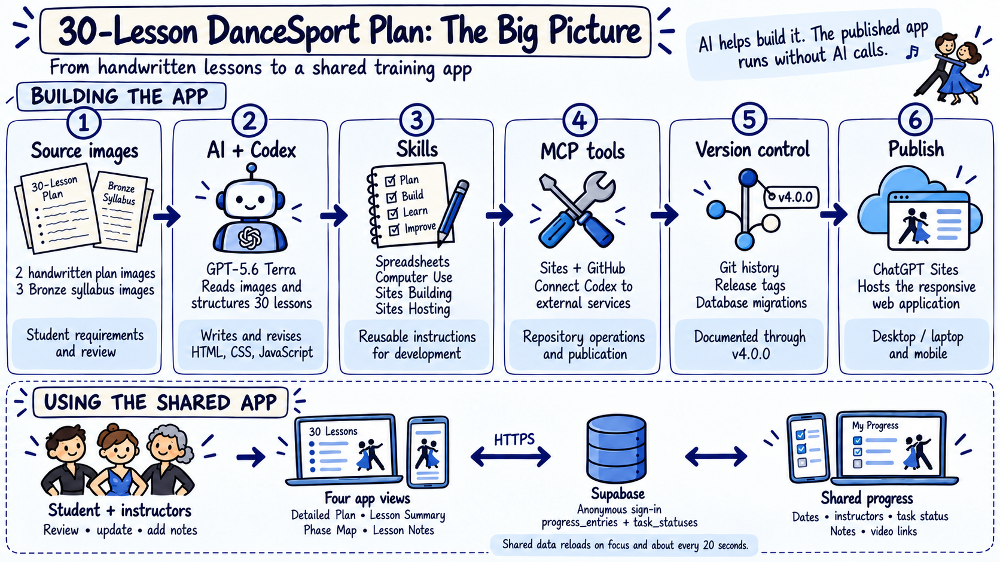
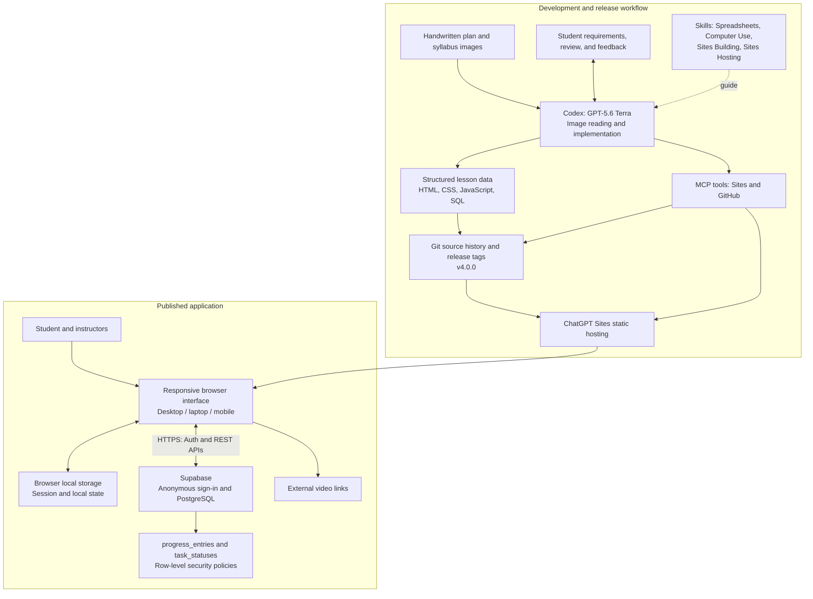

# From a handwritten plan to a web application

*How I turned 30-Lesson DanceSport plan into a web application that my instructors and I could view, track and update together.*

Solution documentation for **30-Lesson DanceSport Plan**, through **v4.0.0** · September 16, 2026

## Problem

The handwritten training plan was difficult to read, and there was no convenient way for my dance instructors and me to view, share, and update it together.

We needed a shared place where we could quickly answer everyday questions: What are we working on today? What have we completed? What still needs to be completed?

## Solution

That’s why I vibe-coded the **30-Lesson DanceSport Plan**, a web application that allows us to review upcoming lessons, track progress, add notes, store video references, and update the plan together.

The application is optimized for both **desktop/laptop and mobile devices**, making the same shared training plan easily accessible across devices.

### View: Detailed Plan

The most granular view, providing details at the individual lesson-item level. Open a lesson to review its activities, select the instructor and date, update task progress, and add notes.

### View: Lesson Summary

Provides a lesson-level overview of progress across all 30 lessons, making it easy to see the status of each lesson at a glance.

### View: Phase Map

Provides a phase-level overview, showing how the 30 lessons fit into the broader training phases and how each phase connects to Bruce Lee-inspired guiding principles.

### View: Lesson Notes

Provides an at-a-glance view of each lesson’s status, notes, and video references.

## Success Criteria

- **Readability and progress visibility:** All 30 lessons are easy to navigate across desktop/laptop and mobile devices, with lesson dates, instructors, completed work, remaining lesson items, and notes clearly visible.
- **Shared collaboration:** Lesson information, progress updates, and notes persist across users, devices, sessions, and page refreshes, enabling everyone to work from the same shared plan.
- **Adoption and usability:** My instructors and I find the application easy to use and regularly rely on it to review lessons, track progress, and capture notes as part of our training routine.

## Scope / Requirements

The application covers a shared 30-lesson DanceSport plan, with Desktop/Laptop and Mobile views for reviewing lessons, tracking progress, and recording notes.

These requirements describe the intended experience and provide acceptance criteria for checking it. Implementation statements are based on source inspection and release records; this document is not a new cross-device test report.

### Shared requirements

| ID | Requirement | Acceptance criterion / v4.0.0 scope |
| --- | --- | --- |
| S01 | Make all 30 lessons readable and structured. | Each lesson has a number, title, phase, and task details; syllabus figure names are incorporated where applicable. |
| S02 | Support the student and dance instructors. | The team can use the shared URL; instructor options and database allowed values must cover participating instructors. |
| S03 | Provide four connected views. | Detailed Plan, Lesson Summary, Phase Map, and Lesson Notes use the same lesson content and shared records. |
| S04 | Track task progress. | Tasks support Not Started, In Progress, and Completed. Summaries derive progress from the shared data. |
| S05 | Record lesson context. | Users can select a lesson date and instructor; saved values remain available after refresh. |
| S06 | Capture notes and video references. | Add Note saves takeaways and optional named video links. Saved history is available across devices. Video files are hosted externally. |
| S07 | Keep notes easy to review. | Lesson Notes shows one row per lesson with meaningful notes/video content, retaining its note and video log. Expanded Detailed Plan lessons also show note history. |
| S08 | Support finding relevant content. | Provide text search and phase/instructor filters where applicable to each view. |
| S09 | Share persistent progress. | Supabase stores team records. Other open sessions refresh on window focus and approximately every 20 seconds. |
| S10 | Minimize access friction. | A shared passcode screen and anonymous Supabase sign-in avoid individual email registration. This is not a private team membership system. |
| S11 | Support portability. | Run in a browser without a native app installation; retain source, schema, and release records to reproduce the deployment. Internet access is needed for shared synchronization. |
| S12 | Preserve release history and recovery information. | Maintain Git commits/tags, VERSION, CHANGELOG, and numbered SQL migrations; back up progress separately from source. |

### Desktop/Laptop requirements

| ID | Requirement | Acceptance criterion |
| --- | --- | --- |
| D01 | Use available width for detailed planning. | Expanded lessons use task tables with time, block, frame, style, dance, activity, and progress information. |
| D02 | Keep navigation and progress visible. | Provide view tabs, filters, and overall progress indicators in the wider layout. |
| D03 | Make editing convenient. | Lesson date, instructor, task status, and Add Note controls are accessible with mouse and keyboard. |
| D04 | Support scanning note history. | Present the Lesson Notes register as a table with lesson number/title, date, status, notes, and video links. |
| D05 | Preserve the wide-screen presentation. | Mobile-specific summaries remain hidden on wider screens; the main plan title stays on one line in the desktop/laptop layout. |

### Mobile requirements

| ID | Requirement | Acceptance criterion |
| --- | --- | --- |
| M01 | Make task details readable on a phone. | Detailed Plan uses compact activity summaries/cards rather than requiring the full desktop table width. |
| M02 | Prevent overlapping controls. | Lesson date and instructor fields fit within the phone viewport and remain readable. |
| M03 | Make frequent actions practical by touch. | Provide compact status controls, reachable Add Note actions, and a note dialog that fits the viewport. |
| M04 | Keep long content contained. | Notes and video names wrap within the mobile layout. |
| M05 | Preserve functional access. | All four views and shared progress/notes remain available; expanded Detailed Plan lessons show note history. |
| M06 | Use the same records across devices. | A saved phone change is available on desktop/laptop after synchronization, and vice versa. |

The application adjusts its views for Desktop/Laptop and Mobile versions within one responsive website. Phone-specific rules chiefly apply at widths of 600px or below, with additional responsive adjustments at 760px.

## Solution Overview

The solution separates the tools used to build it from the services needed to use it.



*The upper half shows how the app was built. The lower half shows what happens when we use it.*

The illustrated overview shows the main components. The diagram below provides the more detailed technical connections.



| Component | Role |
| --- | --- |
| GPT-5.6 Terra / Codex | Read source images, structure content, implement changes, and use development tools. |
| Skills | Written workflows used during development: Spreadsheets for the supporting workbook; Computer Use for browser interaction; Sites Building and Sites Hosting for website work and publication. |
| MCP | Model Context Protocol tool connections used for Sites creation/versioning/deployment and GitHub repository operations. MCP is part of the development workflow, not the browser-to-database connection. |
| HTML, CSS, JavaScript | Render the four views, responsive layouts, forms, status calculations, and synchronization behavior. |
| ChatGPT Sites | Serve the static website from the deployment output. `.openai/hosting.json` identifies `dist` as the published directory. |
| Supabase | Provide anonymous authentication and persistent shared data through HTTPS APIs. |
| Git / GitHub | Track implementation and release changes. The local `origin` points to the Sites source repository; development records also show GitHub mirroring through connector tools. |
| Browser storage | Retain configuration, anonymous session, and local state. Local drafts are not proof that data reached other devices. |

## Detailed Solution

### Workflow

I supplied two images of the handwritten plan and three images of the Bronze Smooth and Rhythm syllabus. GPT-5.6 Terra read them and helped turn their content into structured lessons and named dance figures.

This was visual transcription and interpretation, with my feedback guiding revisions. The build record shows direct image reading rather than a separate OCR service.

The plan progresses through six phases: foundation figures, early rounds tests, additional figures and blending, slow-motion technique, focused coaching, and video-based progress review. Its organization reflects the Bruce Lee-inspired principles in my training brief, including depth of practice, adaptation, quality of effort, and recording what helps.

After practicing a task, an instructor can mark it In Progress or Completed and save a takeaway with a named video link. I can review that record from another device before the next lesson.

The app reloads shared data when I return to its tab and approximately every 20 seconds while it remains open. Internet connectivity is needed for shared updates.

A shared passcode screen and anonymous database sign-in avoid separate instructor email accounts. The passcode is a browser-side convenience gate rather than a private membership system. Video links retain the access rules of wherever the videos are hosted.

### AI model and source-image transcription

**GPT-5.6 Terra (`gpt-5.6-terra`) in Codex** was used during the recorded development work. The build log shows direct image viewing for:

- `Source/30 Lesson Plan 01 - 20260908.jpeg`
- `Source/30 Lesson Plan 02 - 20260908.jpeg`
- `Source/Bronze Syllabus/Bronze_Smooth.jpeg`
- `Source/Bronze Syllabus/Bronze_Rhythm_01.jpeg`
- `Source/Bronze Syllabus/Bronze_Rhythm_02.jpeg`

The model read the images visually and converted their content into structured lesson and syllabus information. This was an OCR-like transcription and interpretation workflow; the inspected evidence does not establish a separate OCR engine. User feedback then guided corrections and presentation changes. No formal OCR accuracy score was recorded.

The resulting lesson/figure definitions are stored in the application source. A supporting workbook is also retained under `Source/Lessons/`. **v4.0.0 has no end-user image-upload/OCR feature and makes no runtime AI calls.**

### Lesson content and training structure

The plan combines Bronze Smooth and Rhythm syllabus content with a training structure inspired by Bruce Lee's principles, as supplied in the project brief. The app presents the principles as training guidance rather than generating coaching advice dynamically.

| Phase | Lessons | Focus |
| --- | --- | --- |
| 1 | 1–9 | Foundation figures 1–3; depth over variety. |
| 2 | 10–12 | Early rounds tests; practical application. |
| 3 | 13–20 | Foundation figures 4–5 and blending; adaptation. |
| 4 | 21–24 | Slow-motion technique; quality of effort. |
| 5 | 25–27 | Single-focus work and coaching. |
| 6 | 28–30 | Video review and progress checks; personalization. |

### Data model

| Location | Contents and purpose |
| --- | --- |
| JavaScript lesson definitions | The 30 lessons, six phases, activity details, and named syllabus figures. These are source-controlled content. |
| `task_statuses` | One current status per `(lesson_id, task_index)`, plus update time. |
| `progress_entries` | Lesson/task reference, instructor, session date, status, notes, video references, anonymous author ID, and creation time. Multiple entries can belong to one lesson. |

Named video references are stored as serialized name/URL values in the `video_urls` text array. The interface also supports older plain-URL entries. The database stores references, not uploaded video files.

### Progress and note behavior

Task statuses are explicitly selected. Lesson and phase summaries are computed from task statuses and lesson records. In the main summary, a lesson is completed when it has started and all tasks are completed. Start detection uses dated lesson records where present and task progress otherwise.

The Lesson Notes status column has a narrower rule: it shows **Completed** when all tasks are completed and **In Progress** otherwise. Only lessons with meaningful notes or videos appear in that register, so it does not serve as a complete list of unstarted lessons.

Lesson metadata displays the newest matching shared record. The notes register preserves matching saved logs in chronological order within each lesson row. Instructor, phase, and text filters can narrow the visible notes; the filtered result need not include the entire lesson history.

### Synchronization and access

The browser signs in anonymously to Supabase and reads/writes the two tables through REST endpoints. It reloads records on focus and every 20 seconds. This is periodic synchronization, not a WebSocket-based live collaboration system.

The app creates another anonymous session when an expired session returns an authorization error. Note saving respects author-owned records: a browser updates its own applicable record or inserts a new one. Add Note creates a separate log entry, allowing contributions from different sessions without overwriting another session's row.

Row-level security allows authenticated sessions to read shared progress. Progress-entry insertion checks the author ID; updates/deletes are limited to the author. Task-status policies allow shared changes by authenticated sessions. Because anonymous sign-in is enabled and membership is not restricted to a team allowlist, the client-side passcode is only a convenience gate. It is not server-enforced team privacy or verified instructor identity.

The code retains local draft behavior, but does not establish a complete offline queue or conflict-resolution system. Treat shared saves as dependent on connectivity; simultaneous edits to the same task are not merged as separate versions.

### Instructor configuration

Instructor names are configured in the interface and constrained by the database schema. Changes to the participating instructors must be reflected in both the interface options and the database constraint. Anonymous session IDs do not verify instructor identity.

### Source organization and reproduction

| File | Responsibility |
| --- | --- |
| `index.html`, `styles.css` | Page structure, styling, and responsive layout. Some responsive rules are inline in the HTML. |
| `app.js` | Lesson/figure content, core rendering, and base behavior. |
| `overrides.js`, `final-polish.js` | Later rendering, task-status, summary, and presentation changes. |
| `access.js` | Shared passcode interface. |
| `supabase-anon.js` | Shared configuration, anonymous sign-in, data reads, and periodic refresh. |
| `lesson-metadata.js` | Lesson date/instructor controls, note saving, video labels, and note history. |
| `notes-register.js` | Consolidated Lesson Notes and lesson status. |
| `supabase/migrations/`, `supabase.sql` | Versioned schema and current schema reference. |
| `dist/` | Static deployment output. |

`google-sync.js` remains in the source folder but is not loaded by the current `index.html`; Google Sheets is not the v4.0.0 production data store.

For reproduction, use the source at the intended tag, create a Supabase project, enable anonymous sign-ins, apply migrations in order, and configure the browser publishable key/project URL. Assemble the static source/assets into `dist/` and deploy them to a static host. Keep source and deployment output aligned. See [REPRODUCE.md](../REPRODUCE.md) for the existing guide. Progress-table exports must be restored separately when recreating a historical data snapshot.

## Version History for Reproducibility

The application evolved through successive releases as I tested its functionality, reviewed its behavior, and provided iterative feedback for improvements.

**v4.0.0** is the most reliable release to date, consolidating the application's evolution into a shared application for multiple users. Earlier releases already included shared functionality; v4.0.0 brings together the cross-device and shared-note reliability improvements described below.

The first documented release is v1.0.0. “v0.0.0” in the development metrics means the beginning of work, not a verified Git tag.

| Release | Recorded date | Main change |
| --- | --- | --- |
| v1.0.0 | Sep 14, 2026 | First recorded published release: four views, shared Supabase progress, notes/videos, task statuses, and passcode entry. |
| v1.1.0 | Sep 14 | Added phone-specific responsive layouts. |
| v1.1.1–v1.1.9 | Sep 14 | Iterated on mobile task cards, note wrapping, date/instructor controls, and preservation of the desktop layout. |
| v1.1.11 | Sep 14 | Used the newest shared lesson record and automatic data refresh. |
| v2.0.0 | Sep 14 | Stable cross-device release combining desktop presentation, readable phone details, and shared metadata/status/notes. Successful publication completed Sep 16. |
| v2.0.2–v2.0.5 | Sep 16 | Repaired note saving across anonymous sessions, refined note-history handling, and restored notes in Detailed Plan. |
| v3.0.0 | Sep 16 | Stable shared desktop/laptop/mobile release. |
| v3.0.1–v3.0.3 | Sep 16 | Refined the wide-screen title, renewed anonymous access, and retained shared metadata/mobile notes. |
| v3.0.4 | Sep 16 | Renamed the action Add Note and consolidated the notes register while retaining logs. |
| v3.0.5 | Sep 16 | Added lesson status to Lesson Notes. |
| v4.0.0 | Sep 16 | Major stable release of the shared four-view experience. Git tag `v4.0.0` points to commit `21f0a1d`. |

The table follows [CHANGELOG.md](../CHANGELOG.md); absent version numbers are not invented. Local Git tags exist for the major releases and selected intermediate releases, but not every changelog entry has a local tag.

The project's policy uses major versions for major redesigns or database changes requiring migration care, minor versions for compatible features, and patch versions for focused fixes. The release workflow updates the changelog and VERSION, records schema changes as migrations, verifies the app, commits/tags the source, and publishes that version. Source rollback alone does not restore database content; export both progress tables before major changes.

## Resources (time, cost)

The following figures are extracted from the updated **“Development metrics through v4.0.0”** report in the [supplied metrics conversation](https://chatgpt.com/s/cx_6aaacaa0c3bc81919154af8510bc2891). The cutoffs are successful publication, which supersedes the earlier interrupted v2.0.0 release-attempt figures in that conversation.

| Metric | Beginning → v2.0.0 | After v2.0.0 → v4.0.0 | Total through v4.0.0 |
| --- | ---: | ---: | ---: |
| Recorded AI working time | 3h 8m 29s | 56m 11s | **4h 4m 40s** |
| Calendar elapsed time | 114h 21m | 2h 51m | **117h 12m** |
| User prompts | 180 | 24 | **204** |
| Input tokens | 120,374,542 | 37,664,754 | **158,039,296** |
| Output tokens | 306,295 | 82,273 | **388,568** |
| Total tokens | 120,680,837 | 37,747,027 | **158,427,864** |
| Estimated API-equivalent token cost, USD | $34.13 | $9.48 | **$43.60** |

Release boundaries in the report, all EDT:

- Work began September 11, 2026, at 3:25 p.m.
- v2.0.0 publication completed September 16 at 9:47 a.m.
- v4.0.0 publication completed September 16 at 12:38 p.m.

The source reports 1,091 model responses resulting from the 204 prompts. Input tokens include repeatedly supplied conversation and tool context; 153,964,800 input tokens were cached. Output already includes reasoning tokens.

Using the **historical pricing assumptions in that report**—$2 per million uncached input tokens, $0.20 per million cached input tokens, and $12 per million output tokens—the total is:

```text
Uncached input = 158,039,296 − 153,964,800 = 4,074,496
Estimate = (4,074,496 × $2 + 153,964,800 × $0.20 + 388,568 × $12) / 1,000,000
         = $43.604768 ≈ $43.60 USD
```

Totals are calculated before rounding; the displayed phase costs therefore add to one cent more than the displayed grand total. This document reproduces the source's rate assumptions rather than asserting current API prices.

**Cost and effort boundaries:** AI working time is not total human hands-on time. The student's review, testing, and prompt-writing time was not measured. Calendar time includes breaks and a usage-limit delay. The $43.60 estimate is not an actual invoice, a Codex subscription charge, or total project cost. Actual subscription/credit spending, Sites hosting charges, Supabase charges, and human labor cost were not established by the report. Work on this documentation is outside those development totals.

The resources involved were the student's requirements and review effort; Codex and its development tools; five source images and a supporting workbook; a development computer/browser; Git and GitHub repository tooling; ChatGPT Sites hosting; and a Supabase project.

## What's Next

The next step is to learn from using the application during actual lessons: Which views are most useful? Is progress easy to update? How valuable are the saved notes when we return to practice?

That feedback will guide future refinements. The purpose remains the same: help us stay organized, productive, and efficient. More specifically, the application gives my instructors and me a shared place to see what we intend to practice, what we have completed, what remains, and what we want to remember.

### Future AI Capability

The next evolution is to incorporate an LLM so the application can reason over the training plan and answer questions in natural language.

For example:

> “I’m thinking of participating in Team Match on October 24. How many closed figures will I have learned by then? Give me a list of the closed figures by dance type.”

Instead of manually reviewing the 30-lesson plan, the application could use the training data, lesson schedule, and progress to generate a personalized answer—turning the application from a shared digital training plan into an intelligent DanceSport training companion! 💃🏻✨

## Evidence and References

- Implementation: source files at the v4.0.0 workspace, including `index.html`, `app.js`, `overrides.js`, `supabase-anon.js`, `lesson-metadata.js`, and `notes-register.js`.
- Data/access behavior: [initial SQL migration](../supabase/migrations/20260914_001_initial_schema.sql).
- Release history: [CHANGELOG.md](../CHANGELOG.md), [VERSION](../VERSION), and local Git history/tags.
- Reproduction: [REPRODUCE.md](../REPRODUCE.md).
- Development provenance: the original “Create dance lesson plan tracker” record, including image-viewing calls, skill reads, Sites/GitHub tool calls, and recorded model identity. Private development logs are not bundled with this document.
- Effort and cost: [shared metrics report](https://chatgpt.com/s/cx_6aaacaa0c3bc81919154af8510bc2891), using its successful-publication cutoffs.

No production data was changed or new application behavior introduced while preparing this documentation.

